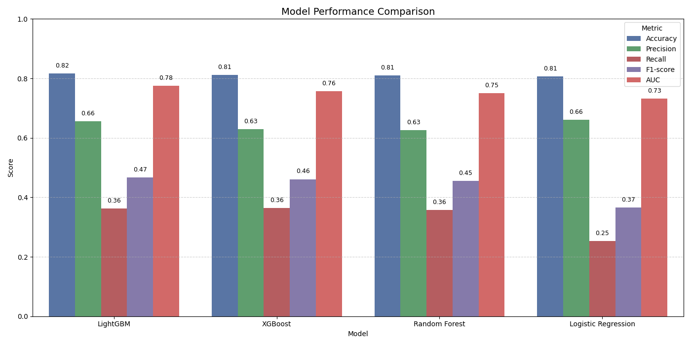
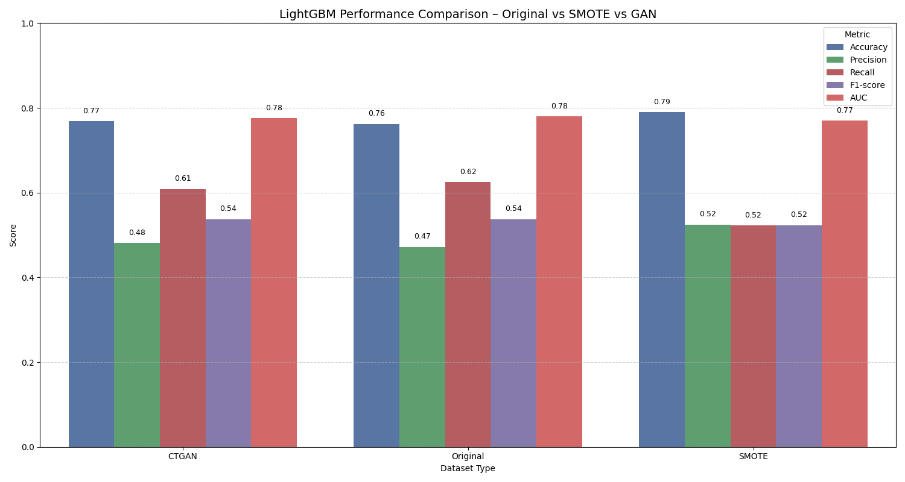
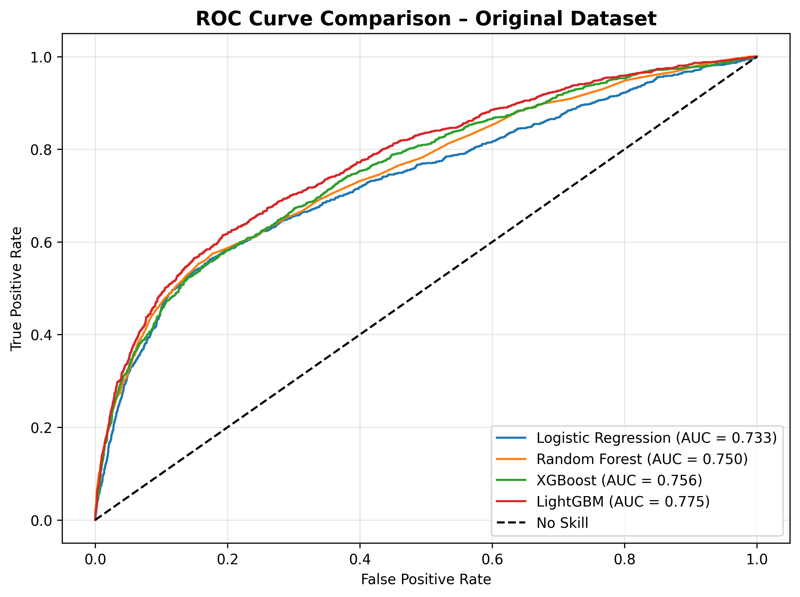

# Enhancing Credit Card Default Prediction Using GAN Based Data Augmentation
---
## Project Overview
This project predicts **credit card payment defaults** using a range of classical and ensemble machine learning models.  
It explores the effects of different **data augmentation and balancing techniques** — namely **SMOTE** and **CTGAN (GAN-based synthetic data generation)** — on model accuracy and fairness.  
The results demonstrate how advanced resampling strategies can improve model generalization when dealing with imbalanced financial datasets.

---

## Dataset
- **Source:** [UCI Default of Credit Card Clients Dataset](https://archive.ics.uci.edu/ml/datasets/default+of+credit+card+clients)  
- **Size:** 30,000 clients × 24 features  
- **Target Variable:** `default payment next month` (1 = Default, 0 = No Default)

---

**Key Features:**
- Demographic data (age, gender, education, marital status)  
- Credit information (limit balance, payment history, bill amounts)  
- Past payment behavior (six-month history)

---

## Workflow & Methodology

1. **Data Preprocessing**
   - Handled missing values and categorical encoding  
   - Applied log and power transformations to reduce skewness  

2. **Exploratory Data Analysis**
   - Visualized class distribution, education, gender, and delay patterns  
   - Analyzed correlation and top predictors for default risk  

3. **Handling Class Imbalance**
   - **Original Dataset:** Highly imbalanced (majority non-defaulters)  
   - **SMOTE:** Synthetic oversampling using geometric interpolation  
   - **CTGAN:** GAN-based synthetic sample generation capturing nonlinear feature relations  

4. **Model Training**
   - Logistic Regression  
   - Random Forest  
   - XGBoost  
   - LightGBM  

5. **Evaluation Metrics**
   - Accuracy  
   - ROC-AUC (Receiver Operating Characteristic – Area Under Curve)  

---

## Results Summary

| **Model**               | **Accuracy** | **Precision** | **Recall** | **F1-score** | **AUC**    |
|------------------------|--------------|---------------|------------|--------------|------------|
| LightGBM               | **0.8170**   | 0.6562        | 0.3625     | 0.4670       | **0.7752** |
| XGBoost                | 0.8118       | 0.6289        | 0.3640     | 0.4611       | 0.7565     |
| Random Forest          | 0.8107       | 0.6262        | 0.3572     | 0.4549       | 0.7504     |
| Logistic Regression    | 0.8060       | **0.6601**    | 0.2532     | 0.3660       | 0.7327     |


---

### **Key Insights**

- **LightGBM** delivered the strongest overall performance, achieving the highest Accuracy **(0.8170)** and AUC **(0.7752)** among all models.

- **XGBoost**, **Random Forest**, and **Logistic Regression** showed slightly lower but comparable results, indicating stable performance across ensemble and linear methods.

- Precision was highest in Logistic Regression **(0.6601)**, suggesting it made more reliable positive predictions despite lower recall.

- Performance differences across models remain moderate, indicating no extreme overfitting or instability; however, LightGBM remains the most effective choice for this dataset.

---

## Visual Results

### Model Performance on Original Dataset  


### LGBM Performance Across Augmented Datasets  


### ROC Curve Comparison  



---

## Key Insights

- **CTGAN** creates more realistic synthetic samples than SMOTE, capturing complex relationships in tabular data.  
- **LightGBM** shows robust performance and scalability for financial risk prediction.  
- **SMOTE** improves minority detection but may slightly reduce overall accuracy.  
- Balancing methods improve fairness and recall for defaulters while maintaining generalization.

---

## License
This project is released under the MIT License.

---

## Project Structure
```
Enhancing_Credit_Card_Default_Prediction_Using_GAN_Based_Data_Augmentation_/
│
├── Enhancing_Credit_Card_Default_Prediction_Using_GAN_Based_Data_Augmentation_.ipynb   # Main Jupyter Notebook (EDA, GAN training & evaluation)
├── README.md                                                                            # Project documentation & visual results
├── LICENSE                                                                              # License for open-source usage
│
├── default of credit card clients.xls                                                  # Original dataset (UCI Credit Default dataset)
├── ctgan_model.pkl                                                                      # Trained CTGAN model for synthetic sample generation
├── requirements.txt                                                                     # Package dependencies for full reproducibility
│
├── model_performance_metrics_unbalanced.png                                            # Baseline performance on original dataset
├── lgbm_dataset_performance_comparison.png                                             # Original vs SMOTE vs GAN comparison
├── roc_comparison_original.png                                                         # ROC curves showing model discrimination ability
                

```
